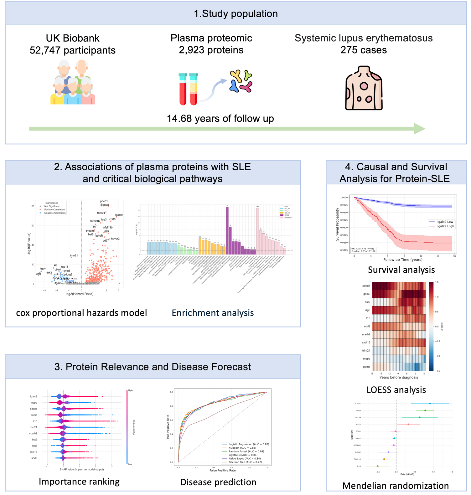

# SLE_Protein

**Study overview.** This study analyzed data from 52,747 participants in the UK Biobank who were initially free of systemic lupus erythematosus (SLE), including 275 individuals who developed SLE during a follow-up period of up to 14.68 years. We first employed Cox proportional hazards models to investigate the associations between plasma proteins and SLE risk, followed by enrichment analyses to elucidate the biological functions of the associated proteins. Using a forward-selection strategy within machine learning frameworks, we identified 11 key proteins that exhibited the strongest associations with SLE. The importance of these proteins was further evaluated using SHapley Additive exPlanations (SHAP) values, and multiple predictive models were developed to estimate SLE risk. Survival analyses were performed to examine the relationships between these proteins and SLE outcomes. Additionally, the LOESS algorithm was applied to visualize temporal changes in protein levels leading up to SLE diagnosis. Finally, Mendelian randomization was employed to explore potential causal relationships between the identified proteins and SLE.